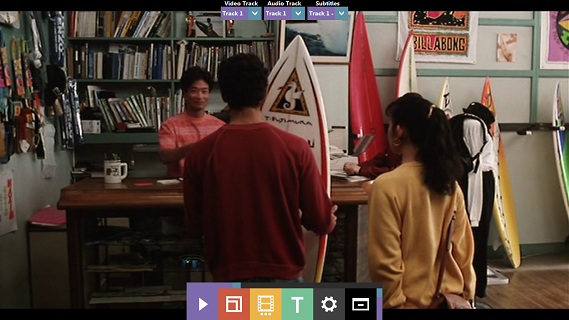

# What is it?
* SpaceVideo is a minimal video player
* Based on libVLC, so it supports the same range of formats that VLC does
* Uses Qt - portable

# Why?
I got tired of VLC's clunky UI. There were only like four buttons I would ever use, so I decided to make my own UI.

# Controls
* First button: toggle playback
* Second: toggle fullscreen
* Third: open local media file
* Fourth: open subtitle file
* Fifth: toggle options menu
* Sixth: minimize

# Source code
* LGPGL v3
* https://github.com/Ohmnivore/SpaceVideo

# Building
* Qt 5.5
* vlc-qt (0.90.0, NOT 0.9.0)